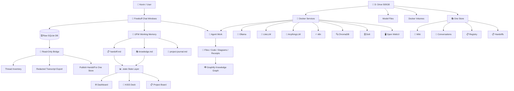
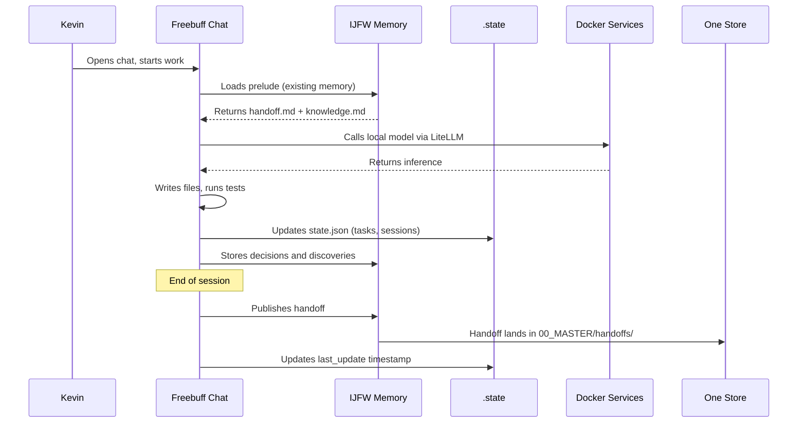

# Architecture

How the shitty system works — layer by layer.

---

## System diagram



---

## The five layers

### Layer 1: Conversation Evidence

**What:** The raw Freebuff SQLite database.  
**Where:** `C:\Users\idfk\.freebuff\desktop-v2.db`  
**Rule:** Immutable source of truth for what was said. Never bulk-copy into other layers.

The read-only bridge (`freebuff-memory/scripts/freebuff_bridge.py`) can:
- List all threads with metadata
- Inspect a thread's messages
- Render a redacted text transcript
- Publish a sanitized handoff to One Store

```
python freebuff_bridge.py threads
python freebuff_bridge.py inspect --thread-id <uuid>
python freebuff_bridge.py transcript --thread-id <uuid> --output export.md
```

### Layer 2: IJFW Working Memory

**What:** Compact cross-chat memory. "It Just Fucking Works."  
**Where:** `harness/freebuff-memory/ijfw/memory/`  
**Files:** `handoff.md`, `knowledge.md`, `project-journal.md`

IJFW is the hot cache that lets Chat B pick up where Chat A left off. It stores:
- **handoff.md** — latest cross-chat handoff (what changed, what's next)
- **knowledge.md** — durable decisions, patterns, and corrections
- **project-journal.md** — append-only timeline of stored memories

**Contract:** Start of chat → load prelude. During chat → store decisions. End of chat → publish handoff. Never store secrets.

### Layer 3: Operational State

**What:** File-based control room for sessions, tasks, and dashboards.  
**Where:** `harness/.state/`  
**Source of truth:** `.state/state.json`

This layer answers: What sessions are open? What tasks are active? What should happen next?

Key surfaces:
- **dash.html** — generated dashboard (refresh with `python gen_dash.py`)
- **KISS Deck** — interactive agent/project dashboard with drag-and-drop cubes
- **Project Board** — filterable next-steps board for all registered projects
- **Butler** — automated end-of-day data collection (`butler.py`)

### Layer 4: Local AI Services

**What:** Docker Compose stack running 7 services on localhost.  
**Where:** `D:\Docker\stack\` (config), `D:\Docker\volumes\` (data)

| Service | Port | Job |
|---|---|---|
| Ollama | 11434 | Local model server (runs models) |
| LiteLLM | 4000 | Unified gateway to multiple models |
| AnythingLLM | 3001 | Workspace hub, RAG, agents |
| n8n | 5678 | Workflow automation |
| ChromaDB | 8000 | Vector search storage |
| Dolt | 3307 | Versioned SQL registry |
| Open WebUI | 8080 | Browser chat for local models |

See [SERVICES.md](SERVICES.md) for detailed health checks and management.

### Layer 5: Project Outputs

**What:** Everything the agents actually build.  
**Where:** Spread across `harness/`, `D:\SHITTYSHIT\`, and individual repos.

Examples:
- Knowledge graphs (`harness/ai-system-explainer/graphify-out/`)
- Diagrams and slides (KISS deck, machine-sections flow)
- Dashboards and project boards
- Migration receipts and documentation
- Memory policies and bridge code

---

## Data flow: How a session works



---

## The One Store (D:\SHITTYSHIT)

The canonical knowledge base. Everything from every agent flows here.

```
SHITTYSHIT/
├── 00_MASTER/           # Core memory and knowledge
│   ├── conversations/   # Thread deposits and exports
│   ├── handoffs/        # Agent handoffs (per-agent folders)
│   ├── memory-loop/     # Raw devlog and memory chain data
│   ├── registry.py      # Artifact database (1500+ files indexed)
│   ├── wiki/            # LLM-compiled knowledge pages
│   └── tools/           # Shared utilities
├── 01_SCHEMA/           # Structured project data
│   ├── projects/        # Per-project folders (PRDs, docs, schemas)
│   ├── dotmds/          # Markdown documents
│   └── prds/            # Product requirement documents
└── 02_WORLD/            # External-facing assets
    ├── brands/
    ├── content/
    └── products/
```

**One Store, three views:**
1. **Files** — the filesystem is the source of truth
2. **Obsidian** — `.obsidian/` marker lets Obsidian open it as a vault
3. **GitHub** — pushed to `shitty-shit/shittyshit` for backup and sharing

---

## The KISS Deck

A visual agent dashboard built on a "cube" metaphor. Each cube represents a project, agent, or resource. Cubes can be dragged, resized, stacked, and assigned tasks.

**Machine Sections data flow:**
```
USER → UI → STATE → PERSIST → SHARE → AGENT
```

- **UI:** Drag, resize, click (Zustand store)
- **STATE:** Cube positions, sizes, assignments (deck-store)
- **PERSIST:** localStorage + bridge API (400ms debounce)
- **SHARE:** Commit deck to portable JSON files
- **AGENT:** Brief dispatch via markdown inbox

**Modes:**
- **Coders** — AI agent management (Freebuff, Codex, Goose, etc.)
- **Writer** — STFU+WRITE drafting surface (FLOW, FREEWRITE, EDIT, REFERENCE, OUTPUT)
- **Full** — everything visible

---

## Technology choices

| Decision | Rationale |
|---|---|
| Local-first | Control, privacy, no vendor lock-in |
| Docker on D: | 500GB SSD holds models and data; C: stays clean |
| SQLite for raw chats | Simple, portable, no server needed |
| IJFW for memory | Compact, file-based, no external service |
| Markdown everywhere | Human-readable, version-controllable, Obsidian-compatible |
| LiteLLM gateway | One API for Ollama, cloud models, anything else |
| Compose for services | Declarative, reproducible, easy to manage |
| KISS Deck for UI | Visual dashboard without a heavy frontend framework |
