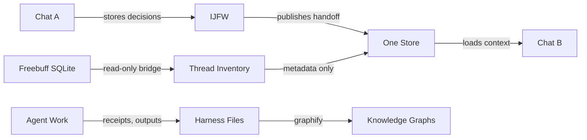

# Memory

How the system remembers things across sessions.

---

## The problem

AI chat agents have amnesia. Every new conversation starts from zero. This system fixes that with three memory layers, each with a different job.

---

## Three layers of memory

```
┌─────────────────────────────────────────────┐
│  Layer 1: RAW EVIDENCE                      │
│  Freebuff SQLite database                   │
│  Immutable. Never copied wholesale.         │
│  The source of truth for what was said.     │
└──────────────────┬──────────────────────────┘
                   │ (read-only bridge)
┌──────────────────▼──────────────────────────┐
│  Layer 2: WORKING MEMORY                    │
│  IJFW files (handoff, knowledge, journal)   │
│  Compact. Cross-chat. The hot cache.        │
│  What Chat B needs to know from Chat A.     │
└──────────────────┬──────────────────────────┘
                   │ (publish handoff)
┌──────────────────▼──────────────────────────┐
│  Layer 3: CANONICAL STORE                   │
│  One Store (D:\SHITTYSHIT)                  │
│  Permanent knowledge base.                  │
│  Wiki, conversations, registry, handoffs.   │
└─────────────────────────────────────────────┘
```

---

## Layer 1: Raw Evidence (Freebuff SQLite)

**What:** Every message from every Freebuff chat, stored in SQLite.  
**Where:** `C:\Users\idfk\.freebuff\desktop-v2.db`  
**Rule:** This is the source of truth. Never bulk-copy into other layers.

### Using the bridge

The read-only bridge (`freebuff-memory/scripts/freebuff_bridge.py`) accesses the database without modifying it.

```powershell
# List all threads
python freebuff_bridge.py threads

# Inspect a specific thread
python freebuff_bridge.py inspect --thread-id <uuid>

# Export a redacted transcript
python freebuff_bridge.py transcript --thread-id <uuid> --output export.md

# Publish a handoff to One Store
python freebuff_bridge.py publish-handoff --thread-id <uuid>
```

### What gets exported

- Thread metadata (ID, timestamps, agent, model)
- Message counts and summaries
- Redacted text (secrets removed)
- Handoffs (compressed session summaries)

### What does NOT get exported

- Raw transcripts bulk-copied to memory
- Credentials or secrets
- Binary file contents

---

## Layer 2: IJFW Working Memory

**What:** Compact cross-chat memory files. "It Just Fucking Works."  
**Where:** `harness/freebuff-memory/ijfw/memory/`

### The three files

| File | Purpose | Format |
|---|---|---|
| `handoff.md` | Latest cross-chat handoff | What changed, decisions, next action |
| `knowledge.md` | Durable decisions and patterns | Facts, corrections, preferences |
| `project-journal.md` | Timeline of stored memories | Append-only log with timestamps |

### The chat contract

```
START OF CHAT:
  → Load prelude (read handoff.md + knowledge.md)
  → Understand where the last chat left off

DURING CHAT:
  → Store durable decisions when they happen
  → Store corrections and new patterns
  → Update knowledge.md as needed

END OF CHAT:
  → Publish compact handoff to handoff.md
  → Include: what changed, what's next, open questions
  → Never include secrets
```

### Verification

After restarting Freebuff, verify memory works:

1. Open Chat A → store a unique canary value
2. Open Chat B → ask what Chat A stored
3. Chat B should retrieve the canary through IJFW

Or run the automated check:
```powershell
powershell -ExecutionPolicy Bypass -File freebuff-memory/scripts/verify.ps1
```

---

## Layer 3: One Store (D:\SHITTYSHIT)

**What:** The permanent canonical knowledge base. Everything from every agent flows here.  
**Where:** `D:\SHITTYSHIT`  
**GitHub:** `github.com/shitty-shit/shittyshit`

### Structure

```
00_MASTER/
├── conversations/      # Thread deposits and exports
│   ├── threads/        # Individual conversation threads
│   ├── inbox/          # Pending session envelopes
│   └── exports-local/  # Raw transcript exports (gitignored)
├── handoffs/           # Agent handoffs
│   ├── freebuff/       # Freebuff handoffs
│   ├── codex/          # Codex handoffs
│   └── cline/          # Cline handoffs
├── memory-loop/        # Raw devlog and memory chain data
├── registry/           # Artifact manifests and provenance
├── wiki/               # LLM-compiled knowledge pages
├── tools/              # Shared utilities
└── workflows/          # Repeatable capture/ingest/lint definitions

01_SCHEMA/
├── projects/           # Per-project folders
├── dotmds/             # Markdown documents
└── prds/               # Product requirement documents

02_WORLD/
├── brands/
├── content/
└── products/
```

### The wiki

`00_MASTER/wiki/` is the LLM-compiled knowledge layer. It contains:
- Entity pages (agents, projects, tools)
- Concept pages (machine-sections, one-store, commit-gate)
- An index and a log of changes

**Rules:**
- Read `wiki/index.md` to answer questions
- Never edit raw sources from the wiki
- Update pages with provenance (sources in frontmatter)
- Surface contradictions with ⚠️ notes for Kevin — never silently resolve
- Run `python 00_MASTER/wiki/lint.py` after edits

### The registry

`00_MASTER/REGISTRY.md` is an index of 1500+ files in the system. Regenerate it:
```powershell
python 00_MASTER/registry.py
```

### Publishing to One Store

From the harness bridge:
```powershell
python freebuff_bridge.py publish-handoff --thread-id <uuid>
```

This writes to `00_MASTER/handoffs/freebuff/LATEST.md` and creates an immutable history file.

From manual work:
- Conversations → `00_MASTER/conversations/threads/`
- Handoffs → `00_MASTER/handoffs/<agent>/`
- Project material → `01_SCHEMA/projects/<slug>/`

---

## Memory policy

### What belongs in memory

- Durable decisions and their reasons
- Corrections to previous assumptions
- Discovered patterns and preferences
- Session handoffs (what changed, what's next)
- Open questions and blockers

### What does NOT belong in memory

- Credentials, API keys, or secrets
- Raw conversation transcripts (keep in SQLite)
- Temporary working data
- Generated files (keep the source, not the output)
- Personally identifiable information beyond what's necessary

### The commit gate

**Reference ≠ Representation.** A reference to a file is not the file itself. Memory should store pointers and summaries, not bulk data.

---

## How memory flows



---

## Checking memory health

```powershell
# 1. Verify IJFW transport
powershell -ExecutionPolicy Bypass -File freebuff-memory/scripts/verify.ps1

# 2. Run bridge tests (should pass 3/3)
cd freebuff-memory
python -m pytest tests/ -v

# 3. Check One Store registry
python D:\SHITTYSHIT\00_MASTER\registry.py

# 4. Lint the wiki
python D:\SHITTYSHIT\00_MASTER\wiki\lint.py

# 5. Verify cross-chat continuity
# Open Chat A → store a canary → Open Chat B → ask for the canary
```
