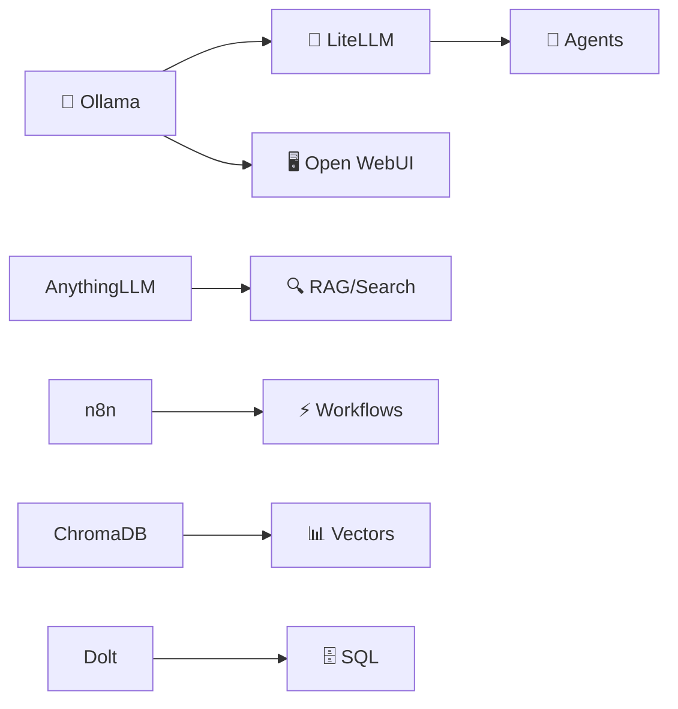

# Services

The Docker service room — 7 services running on localhost, all data on D:.

---

## Service map

| Service | Container | Port | Image | Data on D: | Memory Limit |
|---|---|---|---|---|---|
| **Ollama** | shitty-ollama | 11434 | `ollama/ollama:latest` | `D:\Docker\volumes\ollama` | 2 GB |
| **LiteLLM** | shitty-litellm | 4000 | `ghcr.io/berriai/litellm:main-stable` | `D:\Docker\volumes\litellm` | 1.5 GB |
| **AnythingLLM** | shitty-anythingllm | 3001 | `mintplexlabs/anythingllm:latest` | `D:\Docker\volumes\anythingllm` | 1 GB |
| **n8n** | shitty-n8n | 5678 | `n8nio/n8n:latest` | `D:\Docker\volumes\n8n` | 1 GB |
| **ChromaDB** | shitty-chroma | 8000 | `chromadb/chroma:latest` | `D:\Docker\volumes\chroma` | 512 MB |
| **Dolt** | shitty-dolt | 3307 | `dolthub/dolt-sql-server:latest` | `D:\Docker\volumes\dolt` | 512 MB |
| **Open WebUI** | shitty-openwebui | 8080 | `ghcr.io/open-webui/open-webui:main` | `D:\Docker\volumes\open-webui` | 1.5 GB |

**Optional (opt-in):**

| Service | Container | Port | Profile | Notes |
|---|---|---|---|---|
| **Unsloth** | shitty-unsloth | 8888, 8000 | `unsloth` | Training/workbench. Needs compatible GPU. |

**Native (not in Docker):**

| Service | Port | Notes |
|---|---|---|
| **Ollama (native)** | 11434 | Runs natively for GPU access. LiteLLM reaches it at `host.docker.internal:11434` |
| **llama.cpp** | 8080 | Native build, Qwen2.5-3B Q4_K_M, AMD 780M iGPU, Vulkan |

---

## Service details

### Ollama (port 11434)

**What it does:** Runs local language and embedding models.

**Health check:**
```powershell
curl http://127.0.0.1:11434/api/tags
# Should return a JSON list of available models
```

**Management:**
```powershell
# List models
curl http://127.0.0.1:11434/api/tags

# Pull a new model
curl http://127.0.0.1:11434/api/pull -d '{"name":"qwen2.5:3b"}'

# Test inference
curl http://127.0.0.1:11434/api/generate -d '{"model":"qwen2.5:3b","prompt":"Hello","stream":false}'
```

**Important:** Do not start a second Ollama instance. The Docker container and native Ollama share port 11434 — only one should run at a time.

### LiteLLM (port 4000)

**What it does:** Unified gateway — one API endpoint for multiple model backends (Ollama, cloud APIs, etc.).

**Health check:**
```powershell
curl http://127.0.0.1:4000/health
# Should return healthy status
```

**Management:**
```powershell
# Test a real inference request
curl http://127.0.0.1:4000/v1/chat/completions `
  -H "Content-Type: application/json" `
  -d '{"model":"local-qwen","messages":[{"role":"user","content":"Say hello"}]}'

# Check model list
curl http://127.0.0.1:4000/v1/models
```

**Config:** `docker-stack/litellm-config.yaml`

### AnythingLLM (port 3001)

**What it does:** Workspace hub with RAG (retrieval-augmented generation), agent support, and MCP integration.

**Health check:**
```powershell
curl http://127.0.0.1:3001/api/v1/system
# Should return system info
```

**Status:** Page loads (HTTP 200), but the complete memory/RAG round-trip is not yet proven.

### n8n (port 5678)

**What it does:** Workflow automation — visual automation builder for connecting services and APIs.

**Health check:**
```powershell
curl -o /dev/null -s -w "%{http_code}" http://127.0.0.1:5678
# Should return 200
```

**Access:** Open `http://127.0.0.1:5678` in browser for the visual workflow editor.

### ChromaDB (port 8000)

**What it does:** Vector database for semantic search and RAG.

**Health check:**
```powershell
curl http://127.0.0.1:8000/api/v1/heartbeat
# Should return heartbeat response
```

### Dolt (port 3307)

**What it does:** Git-like versioned SQL database — data with full history.

**Health check:**
```powershell
curl http://127.0.0.1:3307/health
# Or connect via MySQL client on port 3307
```

### Open WebUI (port 8080)

**What it does:** Browser-based chat interface for local models (connected to Ollama).

**Health check:**
```powershell
curl -o /dev/null -s -w "%{http_code}" http://127.0.0.1:8080
# Should return 200
```

**Access:** Open `http://127.0.0.1:8080` in browser.

---

## Management commands

### Start all services
```powershell
cd D:\Docker\stack
docker compose up -d
```

### Stop all services
```powershell
cd D:\Docker\stack
docker compose down
```

### Check status
```powershell
cd D:\Docker\stack
docker compose ps
```

### View logs
```powershell
# All services
docker compose logs -f

# Specific service
docker compose logs -f ollama
docker compose logs -f litellm
docker compose logs -f n8n
```

### Restart a single service
```powershell
docker compose restart litellm
```

### Start with Unsloth (opt-in)
```powershell
docker compose --profile unsloth up -d
```

---

## Service dependencies



**Key dependency:** LiteLLM and Open WebUI both depend on Ollama. Start Ollama first (or ensure it's running) before the others.

---

## Data locations

All service data lives on the D: drive:

```
D:\Docker\volumes\
├── ollama\           # Model files (can be large — 10s of GB)
├── litellm\          # LiteLLM config + data
├── anythingllm\      # AnythingLLM workspace + storage
├── n8n\              # n8n workflows and data
├── chroma\           # ChromaDB vector data
├── dolt\             # Dolt SQL databases
└── open-webui\       # Open WebUI user data
```

**Do not delete these directories** unless you're prepared to re-download models and rebuild workspaces.

---

## Security notes

- All services are bound to `127.0.0.1` (localhost only) — not exposed to the network
- Open WebUI has a default secret key (`shittyshit-openwebui-2026`) — change it if exposing to LAN
- AnythingLLM has its own auth system — set it up through the web UI
- n8n has its own user system — set up the first owner account on first access
- Never put API keys in docker-compose.yml — use `.env` files
- The `.env` file is gitignored — never commit it
