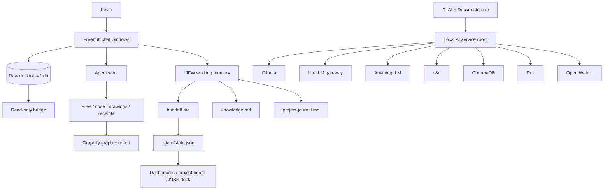

# LACES_CASES / Freebuff Harness — Executive Handoff

**Audience:** Kevin or a new operator with little or no prior context  
**Workspace:** `C:\Users\idfk\Desktop\harness`  
**Status:** 2026-08-19

## Start here

Open the live [Harness Home](http://127.0.0.1:8788/) first. It combines current service probes, Freebuff threads, the latest IJFW handoff, recent artifacts, and open blockers. Then use the [clickable cheat sheet](HARNESS_CHEATSHEET.html) or the [Markdown cheat sheet](AI-SYSTEM-CHEAT-SHEET-2026-08-19.md), the [AI/Docker system graph](ai-system-explainer/graphify-out/graph.html), the [main dashboard](.state/dash.html), and the [latest IJFW handoff](freebuff-memory/ijfw/memory/handoff.md).

The [browser slide deck](HARNESS_SYSTEM_SLIDES.html) is the visual introduction. The [stakeholder PowerPoint briefing](HARNESS-STAKEHOLDER-BRIEFING-2026-08-19.pptx) is the polished nontechnical handoff. This file is the complete index and operating handoff.

## Executive summary

This computer is being organized as a local-first AI server room and multi-agent workbench.

- **Freebuff** provides the agent chat windows.
- **Freebuff SQLite** preserves raw conversation evidence.
- **IJFW** stores compact cross-chat memory: decisions, knowledge, journal entries, and handoffs.
- **`.state`** tracks sessions, goals, tasks, dashboards, project pages, and agent queues.
- **Docker / Ollama / LiteLLM / AnythingLLM / n8n / ChromaDB / Dolt / Open WebUI** form the intended local service room.
- **D:** is the intended home for AI applications, models, Docker volumes, caches, and rollback copies.
- **Graphify** turns curated documentation into navigable knowledge graphs.
- **Receipts** record what happened and preserve a way back.

The system is substantial and the current local service room is running. The live **Harness Home** page now provides the operational front door; the underlying evidence and source files remain linked and inspectable.

## Status language

| Label | Meaning |
|---|---|
| `VERIFIED` | Confirmed by a current command, test, health check, or file inspection |
| `HISTORICAL` | Confirmed earlier and recorded in a receipt, but not rechecked after the latest restart |
| `CONFIGURED` | Code/config exists, but runtime behavior is not proven |
| `INFERRED` | Reasonable explanation, not direct proof |
| `OPEN` | Work remains or a decision is needed |
| `BLOCKED` | An external condition currently prevents verification |

## Current truth

### Verified now

- Freebuff’s thread database is readable through the read-only bridge.
- IJFW transport starts, but the current `verify.ps1` run does not recall the setup-time cross-chat canary; treat continuity as open until refreshed.
- Freebuff bridge tests pass 3/3.
- The workspace contains persistent threads, memory, dashboards, project pages, diagrams, and receipts.
- The curated AI system explainer and graph exist under [`ai-system-explainer/`](ai-system-explainer/).
- Docker Desktop is running and all seven normal Compose services are up on localhost.
- Open WebUI, Ollama, LiteLLM, and AnythingLLM returned HTTP 200; Ollama listed models.
- A real LiteLLM request through `local-qwen` returned `FINAL_DOC_CHECK`.
- The D-backed native Unsloth server returned HTTP 200 on `/api/health`.

### Historical but important

The [2026-08-18 migration receipt](AI-SERVER-MIGRATION-RECEIPT-2026-08-18.md) records verified C: → D: migration work, retained rollback copies, successful LiteLLM health/inference, and an Unsloth health pass.

### Open or blocked

- Docker is currently reachable and the seven normal Compose services are running; keep rechecking runtime health after every restart.
- AnythingLLM’s complete memory/RAG round trip is not proven.
- The current IJFW cross-chat canary check is failing even though the transport starts.
- The auto-memory hook cannot find an AnythingLLM-style `memory-loop` path from this workspace; IJFW is the working memory path.
- Obsidian synchronization is not proven; Markdown exports and graph artifacts exist, but no live Obsidian database was confirmed.
- Harness Home is the live operational index, but it is still a view: receipts and raw source files remain the authority for historical claims.

## System map



## What each layer does

### Freebuff and raw chat evidence

Freebuff is where agents receive work and use tools. Its SQLite database is the raw evidence layer. Do not treat a chat claim as a finished result until a file, test, render, or service response proves it.

List threads with [freebuff_bridge.py](freebuff-memory/scripts/freebuff_bridge.py):

```powershell
python .\freebuff-memory\scripts\freebuff_bridge.py threads
```

Inspect or explicitly export one thread:

```powershell
python .\freebuff-memory\scripts\freebuff_bridge.py inspect --thread-id <uuid>
python .\freebuff-memory\scripts\freebuff_bridge.py transcript --thread-id <uuid> --output .\thread-export.md
```

### IJFW working memory

IJFW means “It Just Fucking Works.” It is the compact continuity layer for Freebuff chats.

- [Latest handoff](freebuff-memory/ijfw/memory/handoff.md)
- [Knowledge and decisions](freebuff-memory/ijfw/memory/knowledge.md)
- [Project journal](freebuff-memory/ijfw/memory/project-journal.md)
- [Memory policy](freebuff-memory/MEMORY_POLICY.md)
- [Memory README](freebuff-memory/README.md)
- [Setup receipt](freebuff-memory/receipts/2026-08-16-setup.md)

Verify it with [verify.ps1](freebuff-memory/scripts/verify.ps1), then run the [bridge tests](freebuff-memory/tests/test_freebuff_bridge.py).

### `.state` operational layer

`.state` is the simple file-based control room, separate from raw chats and IJFW.

- [Source of truth: state.json](.state/state.json)
- [Main dashboard](.state/dash.html)
- [Project next-steps board](.state/projects/index.html)
- [KISS agent/project deck](.state/kiss/index.html)
- [KISS slides](.state/kiss/slides.html)
- [KISS state notes](.state/kiss/STATE.md)
- [Machine-sections explanation](.state/kiss/MACHINE_SECTIONS.md)
- [Canonical reconciliation](.state/kiss/CANON_RECONCILIATION.md)

The project board contains many generated pages. Use its index and search instead of opening those pages one at a time.

### Local AI service room

| Tool | Human explanation | Address | Status |
|---|---|---|---|
| Open WebUI | Browser chat for local models | [127.0.0.1:8080](http://127.0.0.1:8080) | VERIFIED HTTP 200 now |
| Ollama | Local model server | [127.0.0.1:11434](http://127.0.0.1:11434) | VERIFIED HTTP 200 and models listed now |
| LiteLLM | One gateway for model routing | [127.0.0.1:4000](http://127.0.0.1:4000) | VERIFIED liveliness HTTP 200 now; inference recorded in current explainer |
| AnythingLLM | Workspace and RAG interface | [127.0.0.1:3001](http://127.0.0.1:3001) | VERIFIED page HTTP 200; memory proof open |
| n8n | Workflow automation | [127.0.0.1:5678](http://127.0.0.1:5678) | VERIFIED HTTP 200 now |
| ChromaDB | Vector search storage | [127.0.0.1:8000](http://127.0.0.1:8000) | VERIFIED heartbeat HTTP 200 now |
| Unsloth | Training/model workbench fallback | `127.0.0.1:8888` | VERIFIED API health now; native D-backed |
| Dolt | Versioned SQL registry | `127.0.0.1:3307` | VERIFIED container running now; SQL query not rechecked |

Plain-language service docs: [overview](ai-system-explainer/00-plain-language-overview.md), [connections](ai-system-explainer/02-how-the-services-connect.md), [gaps](ai-system-explainer/03-current-state-and-gaps.md), and [safe operations](ai-system-explainer/04-operations-and-safety.md).

Current service configuration: [live D: Compose](D:/Docker/stack/docker-compose.yml), [safe Compose example](D:/Docker/stack/docker-compose.example.yml), [LiteLLM routing](D:/Docker/stack/litellm-config.yaml), [server-first operating guide](D:/Docker/stack/SERVER-FIRST-AI.md), and [Unsloth environment template](D:/Docker/stack/unsloth.env.example). The older [parallel LiteLLM setup](dotmd/litellm-stack/START-HERE.md) is reference material, not the current runtime authority.

## What the agents have built

### Memory and continuity

- Dedicated `freebuff-memory` repository.
- Memory policy and start/checkpoint/handoff contract.
- Read-only bridge from Freebuff SQLite to sanitized handoffs.
- Explicit redacted transcript export.
- Idempotent handoff publishing and test coverage.

### Shared state and control surfaces

- `.state/state.json` for goals, sessions, tasks, and next actions.
- Generated dashboard and project next-steps board.
- KISS deck for agents, projects, queues, layouts, and Writer mode.
- Markdown inbox for dispatching work between agents.
- Machine-section/data-flow diagrams.

### AI/Docker infrastructure

- Audited AI/Docker storage and free space.
- Planned and executed a controlled C: → D: relocation.
- Verified copies before junctioning original paths.
- Retained rollback copies.
- Routed local model access through LiteLLM and Docker Ollama.
- Verified local inference before the latest restart.

### Graph and explanation work

- Broad LACES_CASES graph under [`dotmd/graphify-out/`](dotmd/graphify-out/).
- Curated AI/Docker graph under [`ai-system-explainer/graphify-out/`](ai-system-explainer/graphify-out/).
- Plain-language AI/Docker documentation.
- Browser slide deck, executive handoff, and clickable cheat sheet.

### What I have been doing in this thread

I have been the orientation and evidence layer: rescanning the workspace, separating raw chat/memory/state/service layers, checking what drawings really materialized, verifying IJFW and bridge tests, identifying the Docker restart gap, and turning the scattered context into linked handoff material.

## Complete operational code index

### Freebuff memory and bridge

- [freebuff_bridge.py](freebuff-memory/scripts/freebuff_bridge.py) — thread inventory, inspection, transcript rendering, handoff publishing.
- [verify.ps1](freebuff-memory/scripts/verify.ps1) — IJFW transport and canary verification.
- [test_freebuff_bridge.py](freebuff-memory/tests/test_freebuff_bridge.py) — bridge tests; currently 3/3 pass.

### `.state` and dashboards

- [gen_dash.py](.state/gen_dash.py) — generates `.state/dash.html`.
- [gen_projects_dash.py](.state/gen_projects_dash.py) — generates project board/pages.
- [butler.py](.state/butler.py) — end-of-day archives, activity scan, day brief, dashboard refresh.
- [CLOSE-DAY.bat](.state/CLOSE-DAY.bat) — one-click end-of-day wrapper.
- [kiss/gen_kiss.py](.state/kiss/gen_kiss.py) — generates KISS surface.
- [kiss/bridge.py](.state/kiss/bridge.py) — KISS inbox, drafts, decks, and commits bridge.
- [kiss/sw.js](.state/kiss/sw.js) — KISS service worker.

### AI/Docker migration

- [relocate-ai-docker.ps1](relocate-ai-docker.ps1) — dry-run or execute verified relocation.
- [move-ai-rollback-to-d.ps1](move-ai-rollback-to-d.ps1) — moves retained rollback copies.
- [move-remaining-ai-rollback-to-d.ps1](move-remaining-ai-rollback-to-d.ps1) — completes remaining rollback relocation.

### AI system graph

- [build_graph.py](ai-system-explainer/build_graph.py) — builds the curated AI/Docker graph.
- [AI-SYSTEM-EXTRACTION.json](ai-system-explainer/AI-SYSTEM-EXTRACTION.json) — curated facts and relationships used by that graph.

### Memory-loop prototype

- [memory.py](dotmd/memory-loop/memory.py) — AnythingLLM/LanceDB memory CLI.
- [mcp_server.py](dotmd/memory-loop/mcp_server.py) — memory MCP server.
- [MCP_CONFIGS.md](dotmd/memory-loop/MCP_CONFIGS.md) — MCP configuration notes.
- [MEMORY_SPEC.md](dotmd/memory-loop/MEMORY_SPEC.md) — memory entry format.
- [SETUP.md](dotmd/memory-loop/SETUP.md) — AnythingLLM setup guide.

### LiteLLM setup

- [setup.py](dotmd/litellm-stack/setup.py), [setup.cmd](dotmd/litellm-stack/setup.cmd), and [setup.sh](dotmd/litellm-stack/setup.sh) — setup wrappers.
- [keys.py](dotmd/litellm-stack/keys.py), [keys.cmd](dotmd/litellm-stack/keys.cmd), and [keys.sh](dotmd/litellm-stack/keys.sh) — key/config helpers; keep secrets private.
- [docker-compose.yml](dotmd/litellm-stack/docker-compose.yml) and [docker-compose.redis.yml](dotmd/litellm-stack/docker-compose.redis.yml) — service recipes.
- [litellm_config.yaml](dotmd/litellm-stack/litellm_config.yaml) — routing configuration.

### Other utility

- [create_skills_spreadsheet.py](dotmd/create_skills_spreadsheet.py) — skills reference spreadsheet generator.

## Visuals and major outputs

- [Clickable cheat sheet](HARNESS_CHEATSHEET.html)
- [Browser slide deck](HARNESS_SYSTEM_SLIDES.html)
- [Curated AI/Docker graph](ai-system-explainer/graphify-out/graph.html)
- [Curated graph report](ai-system-explainer/graphify-out/GRAPH_REPORT.md)
- [Broad LACES_CASES graph](dotmd/graphify-out/graph.html)
- [Broad graph report](dotmd/graphify-out/GRAPH_REPORT.md)
- [KISS dashboard](.state/kiss/index.html)
- [KISS slides](.state/kiss/slides.html)
- [Project board](.state/projects/index.html)
- [Machine-sections diagram](.state/kiss/diagrams/machine-sections-flow.png)
- [Brief-dispatch SVG](.state/kiss/diagrams/brief-dispatch-flow.svg)
- [Brief-dispatch PNG](.state/kiss/diagrams/brief-dispatch-flow.png)

## Canonical documentation and context

- [Existing narrative explainer](HARNESS_EXPLAINER.md)
- [AI/Docker explainer README](ai-system-explainer/README.md)
- [Freebuff memory README](freebuff-memory/README.md)
- [Freebuff memory policy](freebuff-memory/MEMORY_POLICY.md)
- [Project export / PRD snapshot](dotmd/2026-08-12_LACES_CASES_IMAGE_PIPELINE_IDFKAI_PROJECT_EXPORT_PRD.md)
- [Project stack](dotmd/projectstack.md.xlsx)
- [Tool stack](dotmd/toolstack.md.docx)
- [Skills reference](dotmd/skills-reference.xlsx)
- [Canonical tetrad](dotmd/memory-loop/seed/CANONICAL_TETRAD.md)
- [System context](dotmd/memory-loop/seed/SYSTEM_CONTEXT.md)
- [Full graph seed](dotmd/memory-loop/seed/FULL_GRAPH.md)
- [Agent instructions](dotmd/AGENTS.md)
- [Claude instructions](dotmd/CLAUDE.md)
- [IDFKAI PRD package](PRD_now/IDFKAI_WEB_PRD_PACKAGE_2026-08-11/)

## Routine commands

Open the human-facing surfaces:

```powershell
Start-Process .\HARNESS_CHEATSHEET.html
Start-Process http://127.0.0.1:8788/
Start-Process .\HARNESS_SYSTEM_SLIDES.html
Start-Process .\.state\dash.html
Start-Process .\.state\kiss\index.html
Start-Process .\.state\projects\index.html
Start-Process .\ai-system-explainer\graphify-out\graph.html
```

Refresh dashboards:

```powershell
python .\.state\gen_dash.py
python .\.state\gen_projects_dash.py
python .\.state\kiss\gen_kiss.py
```

Recover and verify the AI service room:

```powershell
Start-Process 'D:\Docker\Docker\Docker Desktop.exe'
Set-Location D:\Docker\stack
docker compose up -d
docker compose ps
```

Then perform one real model request through LiteLLM. A green container list or webpage alone is not enough.

## Safe operating rules

- Preserve raw files and raw chat databases.
- Use dry-run modes before migrations or bulk operations.
- Keep rollback copies until the replacement runtime and model list pass verification.
- Keep service ports localhost-only unless authenticated LAN access is intentional.
- Never start a second native Ollama on port 11434.
- Keep credentials in `.env` or a secret store, never in Markdown, graphs, screenshots, or receipts.
- Mark historical claims instead of silently treating them as current.
- End every substantive agent task with changed files, outputs, tests, blockers, and next action.

## Recommended next milestones

1. Keep Docker and the seven-service stack healthy across restarts; re-run one real local inference request after lifecycle changes.
2. Add one artifact receipt per meaningful agent task.
3. Prove or retire the AnythingLLM memory-loop prototype.
4. Decide whether Obsidian becomes a live sync target or the Markdown/graph layer remains canonical.

## Conclusion

The system is not empty or imaginary. It has a working local memory bridge, file-based operational state, a documented AI service room, D: migration receipts, dashboards, project views, agent queues, graphs, diagrams, and project context.

It is also not finished. The next phase is visibility and current verification—not more disconnected infrastructure.
