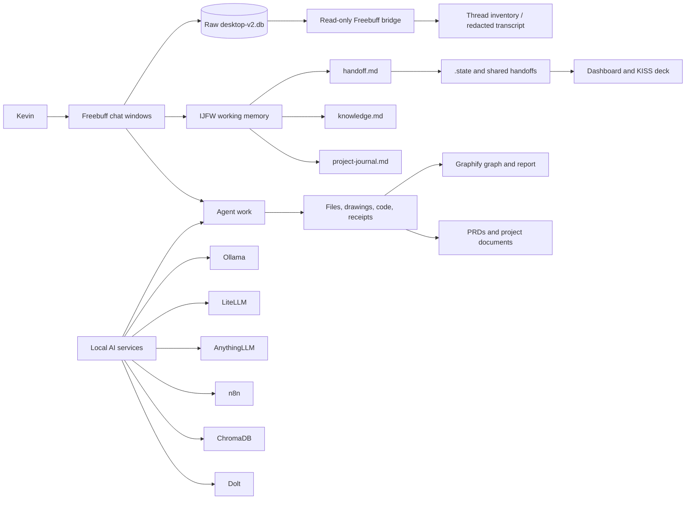

# Kevin’s AI Harness — Plain-Language Explainer

> Start with the [Executive Handoff](EXECUTIVE_HANDOFF.md) or the [clickable cheat sheet](HARNESS_CHEATSHEET.html). This file remains the narrative explainer; the handoff is the complete index.

**Status date:** 2026-08-19  
**Purpose:** Explain what exists, what it does, what has actually been verified, and how to use it without needing to understand the implementation first.

## The short version

This folder is a control room for several AI workers.

The workers are Freebuff/Codex/Codebuff-style chat agents. They can read and write files, run local tools, talk to local models, and leave handoffs for other agents. The harness is meant to preserve the useful result of a conversation instead of making every new chat start from zero.

The system is not one database. It is a set of layers:

1. **Conversation evidence** — the raw Freebuff SQLite database.
2. **Working memory** — IJFW files that summarize decisions and handoffs.
3. **Operational state** — `.state/state.json`, tasks, sessions, and dashboards.
4. **AI services** — Docker services, Ollama, LiteLLM, AnythingLLM, n8n, Chroma, and Dolt.
5. **Project outputs** — Markdown, HTML, diagrams, PRDs, scripts, and receipts.

The biggest remaining problem is visibility: the system creates useful pieces, but it does not yet present them as one simple “what is happening now?” page.

## System map



## What each layer means to a human

### 1. Raw conversations

Freebuff stores conversations in SQLite databases outside this folder. This is the evidence layer: what was actually said and what each chat produced.

Use the bridge to list threads without copying raw conversations into memory:

```powershell
python .\freebuff-memory\scripts\freebuff_bridge.py threads
```

The bridge can also inspect or explicitly render one thread:

```powershell
python .\freebuff-memory\scripts\freebuff_bridge.py inspect --thread-id <uuid>
python .\freebuff-memory\scripts\freebuff_bridge.py transcript --thread-id <uuid> --output .\thread-export.md
```

The raw database remains authoritative. It should not be bulk-copied into every memory layer.

### 2. IJFW working memory

This is the compact memory layer intended to let one chat pick up where another stopped.

- [`freebuff-memory/ijfw/memory/handoff.md`](freebuff-memory/ijfw/memory/handoff.md) — latest handoff.
- [`freebuff-memory/ijfw/memory/knowledge.md`](freebuff-memory/ijfw/memory/knowledge.md) — durable decisions and patterns.
- [`freebuff-memory/ijfw/memory/project-journal.md`](freebuff-memory/ijfw/memory/project-journal.md) — timeline of stored memories.
- [`freebuff-memory/MEMORY_POLICY.md`](freebuff-memory/MEMORY_POLICY.md) — what belongs in memory and what does not.

Current verification: IJFW transport and cross-chat canary pass; the Freebuff bridge tests pass 3/3.

### 3. Operational state and dashboards

`.state` is the plain file-based control layer. It is intended to answer: what sessions are open, what tasks are active, and what should happen next?

- [`.state/state.json`](.state/state.json) — source of truth for goals, sessions, and tasks.
- [`.state/dash.html`](.state/dash.html) — human-readable dashboard generated from `state.json`.
- [`.state/projects/index.html`](.state/projects/index.html) — project next-steps board.
- [`.state/kiss/index.html`](.state/kiss/index.html) — KISS deck / agent-coder control surface.

This layer is useful, but its timestamps can become stale when agents do not checkpoint. A dashboard is a view, not proof that an underlying service is alive.

### 4. Local AI services

The intended local service stack is:

| Service | Plain-language job | Current evidence |
|---|---|---|
| Ollama | Runs local language and embedding models | Current Docker endpoint returned HTTP 200 and a model list |
| LiteLLM | Gives agents one gateway to multiple models | Migration receipt says health and real local inference passed |
| AnythingLLM | Intended searchable semantic memory workspace | Current page returned HTTP 200; complete workspace/search proof is still missing |
| n8n | Workflow automation | Included in the Compose stack |
| ChromaDB | Vector database option | Included in the Compose stack |
| Dolt | Versioned SQL/data layer | Included in the Compose stack |
| Open WebUI | Human-facing local model interface | Included in the Compose stack |

The 2026-08-18 migration receipt says the AI/Docker data was moved from C: to D: using verified copies, junctions, and retained rollback backups. The Docker stack has since been restarted and the normal seven services are currently reachable; the receipt remains the historical record of the migration itself.

### 5. Outputs

The harness has produced more than plans. Confirmed examples include:

- [`brief-dispatch-flow.svg`](.state/kiss/diagrams/brief-dispatch-flow.svg)
- [`brief-dispatch-flow.png`](.state/kiss/diagrams/brief-dispatch-flow.png)
- [`KISS dashboard`](.state/kiss/index.html)
- [`project board`](.state/projects/index.html)
- [`graphify report`](dotmd/graphify-out/GRAPH_REPORT.md)
- [`graphify interactive graph`](dotmd/graphify-out/graph.html)
- [`AI server migration receipt`](AI-SERVER-MIGRATION-RECEIPT-2026-08-18.md)
- [`C-drive migration plan`](C-DRIVE-AI-DOCKER-MIGRATION-PLAN-2026-08-18.md)

The missing capability is a receipt that connects every task to its exact outputs, render status, tests, and unresolved blockers.

## What the agents have been doing

### The architecture work

The agents designed a “middle path” system:

- Keep raw conversations and important files local.
- Use local models and services when control, privacy, or cost matters.
- Use cloud reasoning when it is stronger or faster.
- Compress useful context into handoffs instead of replaying entire chats.
- Preserve raw sources and create additive receipts rather than silently replacing files.

### The memory work

The agents created and verified the Freebuff-to-IJFW memory path, including:

- A shared local memory repository.
- A start/checkpoint/handoff contract.
- A read-only bridge to Freebuff’s SQLite conversation store.
- Redacted transcript export on explicit request.
- Idempotent handoff publishing and metadata receipts.

### The state and dashboard work

The agents built:

- A shared `state.json` session/task layer.
- A generated dashboard.
- A project next-steps board for many project folders.
- A KISS deck prototype for agents, projects, queues, layout persistence, and Writer mode.
- A real Markdown inbox concept for sending work to another agent.

### The AI/Docker storage work

The migration work moved or junctioned AI and Docker-related data toward D: so C: would not fill with models, caches, and application data. The process included dry-run planning, byte-count verification, rollback preservation, and a written receipt.

### What I have been doing in this conversation

I have been acting as the orientation and verification layer:

- Inventorying the harness instead of assuming the plans were implemented.
- Separating raw chat data, IJFW memory, `.state`, graphify, and AnythingLLM.
- Identifying the active threads and showing how to inspect them.
- Verifying the IJFW bridge and its tests.
- Checking whether drawings actually materialized.
- Calling out the gap between “service configured” and “service currently reachable.”
- Providing a report prompt so the other agents can leave structured, evidence-based handoffs.

## Verified on 2026-08-19

- Freebuff thread database is readable through the bridge.
- IJFW verification passes.
- Freebuff bridge unit tests pass 3/3.
- The harness contains open Codebuff and Codex threads with persisted message counts.
- Several diagrams and HTML interfaces exist as files.
- Docker is currently reachable with the normal seven Compose services running on localhost.
- AnythingLLM is reachable, but its complete memory round trip remains unproven.
- The auto-memory hook did not find a configured `memory-loop` path from this workspace.

## How to start a work session

1. Open this document.
2. Open [`.state/dash.html`](.state/dash.html).
3. Read the latest [IJFW handoff](freebuff-memory/ijfw/memory/handoff.md).
4. List active chat threads with the bridge.
5. Pick one task and write down its expected output before asking an agent to build.
6. Require the agent to end with: files changed, outputs produced, tests run, blockers, and next action.

## How to end a work session

Before closing a chat, require a compact handoff:

- What changed.
- Which files are authoritative.
- What was actually tested.
- What did not materialize.
- What Kevin should do next.

Do not treat a generated plan, code snippet, or chat claim as a finished artifact until a file, render, service response, or test proves it exists.

## The next useful build

The highest-value next addition is a single **Harness Home** page that combines:

1. Current service health.
2. Current agent threads.
3. Latest handoff.
4. Recent artifact receipts.
5. Open blockers.
6. Links to dashboards, graphs, memory, and outputs.

That page would turn this system from “a powerful pile of parts” into something a person can operate.
